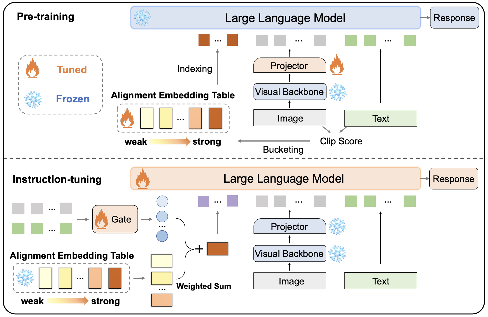

# AlignGPT: Multi-modal Large Language Models with Adaptive Alignment Capability
[[Project Page](https://aligngpt-vl.github.io/)] [[Paper](https://arxiv.org/abs/2405.14129)] [[Demo](http://47.116.173.89:7870/)] [[Model](https://huggingface.co/nlpzhaof)]


Authors: [Fei Zhao*](https://scholar.google.com/citations?user=V01xzWQAAAAJ&hl=zh-CN), Taotian Pang*, Chunhui Li, [Zhen Wu](https://scholar.google.com/citations?user=IoGlgtoAAAAJ&hl=zh-CN), Junjie Guo, Shangyu Xing, [Xinyu Dai](https://scholar.google.com/citations?user=zpWB1CgAAAAJ&hl=zh-CN)

<div align="center">

</div>

<!--  -->

## News and Updates
- [5/24] 🔥 We released **AlignGPT: Multi-modal Large Language Models with Adaptive Alignment Capability**.  Checkout the [paper](https://arxiv.org/abs/2405.14129) and [demo](http://47.116.173.89:7870/).
- [6/1] 🔥 We upload the training data and evaluation data to [aliyupan](https://www.alipan.com/s/oZsvtBAFSry).


## Contents
- [Install](#install)
- [Model Zoo](#model-zoo)
- [Demo](#demo)
- [Training](#training)
- [Evaluation](#evaluation)
- [Performance](#performance)

## Install

### Docker

We recommend to use docker to prepare the environment.

1. Clone this repository and navigate to AlignGPT folder

```bash
git clone https://github.com/AlignGPT-VL/AlignGPT.git
cd AlignGPT
```

2. Build the docker image

```bash
cd deploy
docker build -t aligngpt:1.0 .
```

If your machine cannot connect to github to download the flash attention pip wheel, you can download it manually on https://github.com/Dao-AILab/flash-attention/releases/download/v2.5.5/flash_attn-2.5.5+cu118torch2.1cxx11abiFALSE-cp310-cp310-linux_x86_64.whl and put it to `deploy/flash_attn-2.5.5+cu118torch2.1cxx11abiFALSE-cp310-cp310-linux_x86_64.whl`.

3. To start the container, run the following command in the project root directory

```bash
docker run --gpus all --ipc=host --network=host --rm -it -v .:/workspace aligngpt:1.0
```

More `-v` options can be added to mount the data and output directories.

### Conda

1. Clone this repository and navigate to AlignGPT folder

```bash
git clone https://github.com/AlignGPT-VL/AlignGPT.git
cd AlignGPT
```

2. Install Package

```Shell
conda create -n aligngpt python=3.10 -y
conda activate aligngpt
pip install --upgrade pip  # enable PEP 660 support
pip install torch==2.1.2 torchvision==0.16.2 torchaudio==2.1.2 --index-url https://download.pytorch.org/whl/cu118
pip install -r deploy/requirements.txt
```

Finally, you need to install flash-attention manually before running the model.

## Model Zoo

Please download the weights for LLM, Vision Backbone and place them in the `./playground/model` folder, we also provide all the weights for the AlignGPT checkpoint.

| Model | LLM | Vision Backbone | Pre-training | Instruct-tuning | 
|----------|----------|-----------|---|---|
| AlignGPT-7B | [Vicuna 7B](https://huggingface.co/lmsys/vicuna-7b-v1.5) | [CLIP ViT-L/14](https://huggingface.co/openai/clip-vit-large-patch14-336) |[aligngpt-7b-pretrain](https://huggingface.co/nlpzhaof/aligngpt-7b-pretrain/tree/main)| [aligngpt-7b](https://huggingface.co/nlpzhaof/aligngpt-7b/tree/main)|
| AlignGPT-13B | [Vicuna 13B](https://huggingface.co/lmsys/vicuna-13b-v1.5) | [CLIP ViT-L/14](https://huggingface.co/openai/clip-vit-large-patch14-336) |[aligngpt-13b-pretrain](https://huggingface.co/nlpzhaof/aligngpt-13b-pretrain/tree/main)| [aligngpt-13b](https://huggingface.co/nlpzhaof/aligngpt-13b/tree/main)|
| AlignGPT-LLaMA2 | [LLaMA-2-7B-Chat](https://huggingface.co/meta-llama/Llama-2-7b-chat-hf) | [CLIP ViT-L/14](https://huggingface.co/openai/clip-vit-large-patch14-336) |To be released| To be released|
| AlignGPT-LLaMA3 | [LLaMA-3-8B-Base](https://huggingface.co/meta-llama/Meta-Llama-3-8B) | [CLIP ViT-L/14](https://huggingface.co/openai/clip-vit-large-patch14-336) |To be released|To be released|

## Demo

### Start Gradio UI
You can start gradio service with the following command:

```
cd AlignGPT
bash start_api.sh
```
This script will launch three processes: the controller, the Gradio web server, and the model worker, all of which will run in the background. You can view logs of these processes in folder `log/`, and view process status with command `ps -ef | grep src.serve`.

### CLI Inference
Chat about images using AlignGPT without the need of Gradio interface. 
```
python -m src.serve.cli \
    --model-path playground/model/aligngpt-13b \
    --image-file "image folder/image.jpg" \
```

## Training

We place all training data in the `./playground/data` folder. Please download [aligngpt_pretrain_data](https://www.alipan.com/s/oZsvtBAFSry) from aliyupan and place it in `./playground/data`. We use the MP4 format to store the data as the storage provider has set restrictions on sharing zipped files. After downloading the data, run the following script:
```
wget https://raw.githubusercontent.com/starreeze/drin/main/dataset/data_tools.py
python data_tools.py --dir path/to/datadir \
    --raw_files aligngpt_eval_data.tar.xz aligngpt_pretrain_data.tar.xz \
    --encoded_files eval.mp4 pretrain.mp4
```
It will convert the data to the zipped format and verify md5 checksums. Then unzip the files as usual.

### Pre-training
* **Dataset**: We use the 558K image-text pairs in the pre-training phase. Organize them in `./playground/data` as follows:

```
├── LLaVA-Pretrain
│   └── blip_laion_cc_sbu_558k_with_similarity_number.json
│   └── images
```

* **Run**: You can launch the pre-training phase using the following command:
    ```
    bash scripts/pretrain.sh
    ```
Before running the script of pretraining, you should set the arguments related to **directories** of model checkpoints, data and outputs, *i.e.*, `model_name_or_path`, `data_path`, `image_folder`, `vision_tower` and `output_dir`.

### Instruction-tuning
* **Dataset**: We used 665K image-text pairs/text data in the instruction-tuning phase. The images corresponding to these data include: `COCO`, `GQA`, `OCR-VQA`, `TextVQA`, and `VisualGenome`. Organize them in `./playground/data` as follows:

```
├── llava_v1_5_mix665k.json
├── coco
│   └── train2017
├── gqa
│   └── images
├── ocr_vqa
│   └── images
├── textvqa
│   └── train_images
└── vg
    ├── VG_100K
    └── VG_100K_2
```

* **Run**: You can launch the instruction-tuning stage using the following command:
    ```
    bash scripts/finetune.sh
    ```
Before running the script of instruction tuning, you should set the argument `pretrain_mm_mlp_align`, which is the path where you store the weights of the pre-training phase.

## Evaluation

We place all evaluation data in the `./playground/data/eval` folder. Please download [aligngpt_eval_data](https://www.alipan.com/s/oZsvtBAFSry) from aliyupan and place it in `./playground/data/eval`. We use the MP4 format to store the data as the storage provider has set restrictions on sharing zipped files. After downloading the data, run the following script:
```
wget https://raw.githubusercontent.com/starreeze/drin/main/dataset/data_tools.py
python data_tools.py --dir path/to/datadir \
    --raw_files aligngpt_eval_data.tar.xz aligngpt_pretrain_data.tar.xz \
    --encoded_files eval.mp4 pretrain.mp4
```
  
It will convert the data to the zipped format and verify md5 checksums. Then unzip the files as usual.

We conduct evaluation on 12 benchmarks. Here, we demonstrate how to evaluate the performance of our model on `MME` dataset. We use the following command to run the evaluation stage:
```
CUDA_VISIBLE_DEVICES=0 bash scripts/eval/mme.sh
```
You should set the directories of the model checkpoints and datasets in the scripts before running it. The evaluation of other datasets can be found in [Evaluation.md](docs/Evaluation.md).

## Performance
| Model | VQAv2 | GQA | VizWiz | SQA | T-VQA | POPE | MME | MM-Bench | MM-Bench-CN | SEED | LLaVA-Bench-Wild | MM-Vet |
|----------|---|---|---|---|---|---|---|---|---|---|---|---|
| AlignGPT-7B | 79.1 | 62.9 | 54.2 | 68.5 | 58.4 | 86.0 | 1527.4 | 67.3 | 59.9 | 66.5 | 68.4 | 30.8 |
| AlignGPT-13B | 80.0 | 63.6 | 56.4 | 70.3 | 60.2 | 86.2 | 1572.0 | 69.5 | 63.7 | 67.8 | 75.2 | 35.6 |

## Citation
If you find AlignGPT useful for your research and applications, please cite using this BibTeX:
```
@misc{zhao2024aligngpt,
      title={AlignGPT: Multi-modal Large Language Models with Adaptive Alignment Capability}, 
      author={Fei Zhao and Taotian Pang and Chunhui Li and Zhen Wu and Junjie Guo and Shangyu Xing and Xinyu Dai},
      year={2024},
      eprint={2405.14129},
      archivePrefix={arXiv},
      primaryClass={cs.CL}
}
```

## Acknowledgement
We build our project based on [LLaVA: Large Language and Vision Assistant](https://github.com/haotian-liu/LLaVA).

## License

[](https://github.com/tatsu-lab/stanford_alpaca/blob/main/LICENSE)
[](https://github.com/tatsu-lab/stanford_alpaca/blob/main/DATA_LICENSE)

The data and checkpoint is intended and licensed for research use only. They are also restricted to uses that follow the license agreement of LLaMA, Vicuna and GPT-4. The dataset is CC BY NC 4.0 (allowing only non-commercial use) and models trained using the dataset should not be used outside of research purposes.
